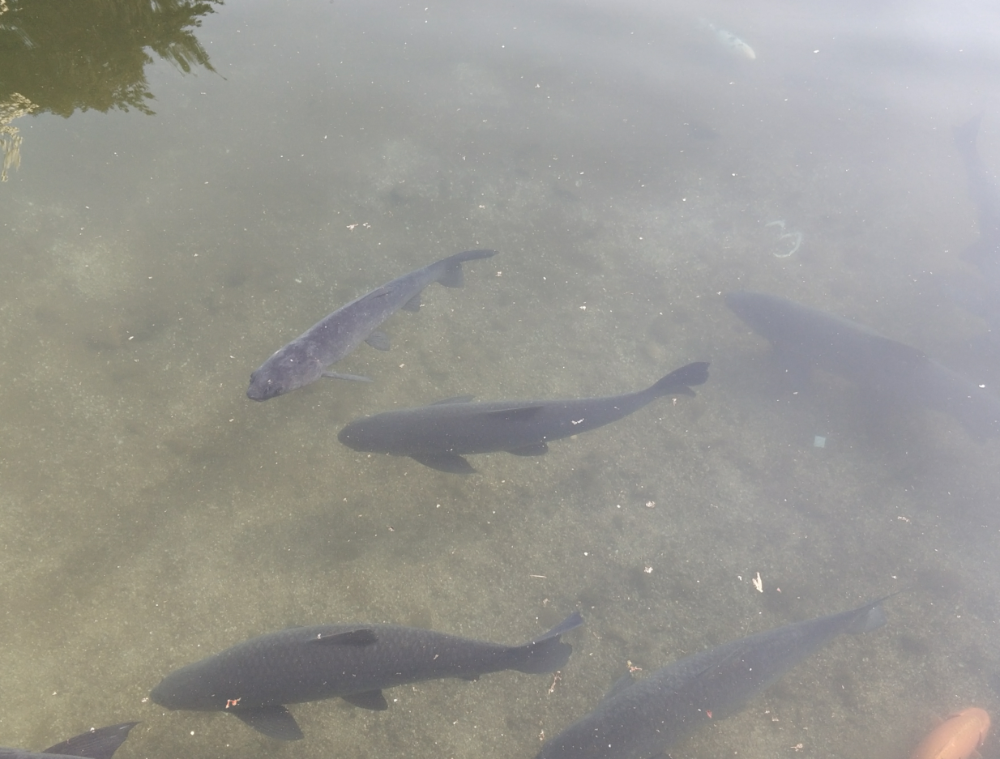
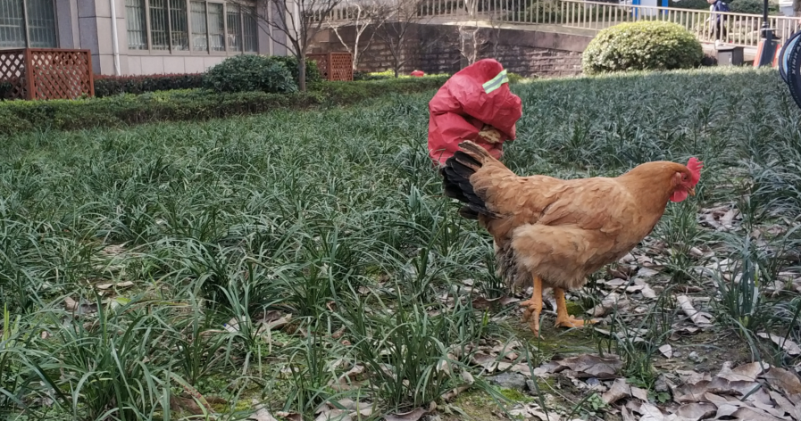

去年9月18号我保研了。今年3月12号晚上6点50，女朋友考研成功上岸。我比较弱，就留在本学院了；我女朋友强一些，最后去了浙大。

结局是快乐的，但过程却波折。她初试成绩刚出来时，虽然蛮低于预期，但也有380+，我觉得也就差不多了吧，能上浙大。

但后来在考研群里慢慢地发现，今年高分好像很多！考研群里汇总成绩时，400分以上的多一个，女朋友吃下的饭就少一点。到了最后，她初试排名已经大于今年的招生名额了，女朋友这时候已经不止吃不下了：经常无缘无故地干呕，吃不下又吐不出来。到了杭州，我俩都看开她干呕这事了，反而自嘲地放弃堂吃，每顿都是我把饭从外面买回来，在房间里吃，免得吓到饭馆老板：自己客人吃了自己家的饭怎么一直呕吐？

复试前，女票就是这样在失学和病倒的边缘试探。

浙大官方排名刚出来的时候，我们还不知道今年会扩招，当时以为连进复试都得上天垂怜了，她交给我一个任务：找调剂。她当时在图书馆整理书架，我搬着电脑，搜到一点儿有用信息就跑过去给她看，安慰几句再跑回桌子上继续查。过了几天，我就成了调剂小专家，哪个学校喜欢招调剂，哪个学校调剂群里干货多，哪个学校还可以，联培发啥证，科学院在哪上课，这些我都懂了。当时最喜欢的就是武大的调剂，如果没考上，调剂到武汉也不错嘛。武大物理学院也有朋友在那，还能问两句。让我高兴的是，这些努力最后全部白费了。

12号下午，她进去复试了，我在曹楼前闲逛，1点15她所在的小组开始复试。我在曹楼门前拍了玉兰，逗了草坪上的鸡，到处找石墩子坐，盯着来浙大里参观的初中生队伍，在马路上追着太阳光走，给问路的人说我不是浙大的…琢磨了下时间，我估计着女朋友该进去面试了，就往曹楼楼下走，还没走几步看微信，她告诉我她已经出来了。

我陪她一起往民宿走，给她讲曹楼前的鸡，听她说英语面试还不错，安慰她没问题。从民宿出来和她在植物园里转了转，走了走路，到名字吉利的“玉泉鱼跃”处拍了拍🐟。

晚上她就知道她考上了，复试60个人排前6。她和她妈妈视频喜极而泣，我跑到卫生间接我妈视频电话，告诉我妈她考上了，我妈说那好呀。不过想不通的是，我妈为啥也掉眼泪了，我妈可是坚定地觉得考研嘛，就难，考个两三年才考上也正常。

后来不止怎的，我俩谈起了浙大楼前的鸡，笑称双一流大学就是厉害，华科东九楼下种菜，浙大曹楼前养鸡。

恭喜她，恭喜我们。175天后，我们都有学上了。下一个小目标：赶早找到在杭州的research intern。