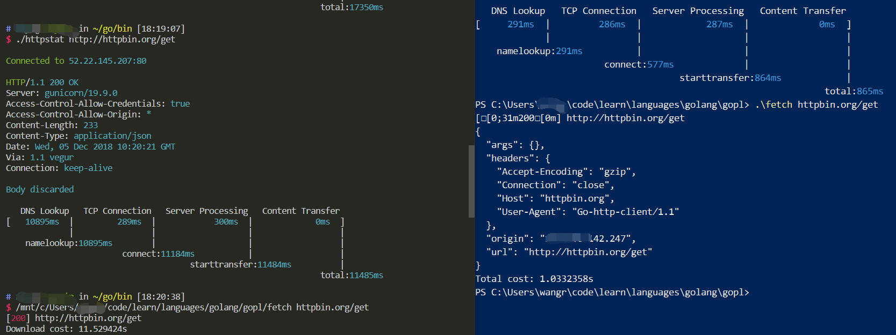

## 背景

我最近打算好好学一下Golang。翻开《The Go Programming Language》第一章`fetch`(page 16)单元，我拷贝了书上的[代码](https://github.com/adonovan/gopl.io/blob/master/ch1/fetch/main.go)执行。发现下载百度首页都需要10s+，用`curl`下载则只需要不到1s，很奇怪。

书上的`fetch`示例主要就两部分，先`http.Get`再`io.Copy`。首先为了排除`io.Copy`的影响，加一行代码测试了下`http.Get`和总的时间：下载一个小[json文件](http://httpbin.org/get)需要21.651425s，执行需要21.656501s。问题确实出在http.Get这里了。


多次测试不同网站后这个问题一直出现，curl比go写的程序快了一个数量级。我傻眼了，不知道什么原因。就整理了下语言，在V2EX上提了个[问题](https://www.v2ex.com/t/514632#reply24).

## V友指导

V友[@icexin](https://www.v2ex.com/member/icexin)提示我可以用`httpstat`看下到底是GET的哪个阶段出了问题, `httpstat`可以展示一个GET请求各个阶段的耗时。

我测了一下，发现主要是耗在DNS Lookup阶段了。这时候注意到我一直是在wsl下执行程序，听说wsl还是有不少bug的，就在PowerShell下也测试了一下：



可以看到这个小程序`fetch`在PoweShell下执行是没有问题的，正常时间。`httpstat`的结果显示差别主要在DNS Lookup阶段。难道WSL下的DNS有毛病？我分别用dig, curl, fetch测试了一下，截取了结果的一部分如下：

```plaintext
$ dig @223.6.6.6 httpbin.org
> ;; Query time: 287 msec

$ ./httpstat httpbin.org/get
> Connected to 34.196.224.14:80
> namelookup:15450ms

$ curl -v httpbin.org/get
> * Connected to httpbin.org (52.3.53.115) port 80 (#0)
> It took 1 seconds
```

对比后发现只有go的程序存在问题，所以和wsl没关系，又回到了问题的起点，为啥curl和fetch在DNS lookup阶段耗时差别这么大呢？

正疑惑的时候，Telegram上有新消息，提醒@icexin回复了我，一看他在13#的[回复](https://www.v2ex.com/t/514632#reply13)我就觉得八九不离十了。他说是因为Golang的`net`库在Unix systems中DNS请求有两种方式，一种是调用系统函数`LookupHost`或者`LookupAddr`请求得到；另一种是用纯Go实现的DNS查询函数。文档提到可以通过设置`export GODEBUG=netdns=go`或者`export GODEBUG=netdns=cgo`来切换两种行为。

赶紧测试了一下：

```plaintext
export GODEBUG=netdns=cgo
> namelookup:154ms
export GODEBUG=netdns=go
> namelookup:15484ms
```

问题显然有了答案：Golang默认使用Go语言实现的DNS查询功能，而curl默认使用系统函数`LookupHost`或者`LookupAddr`。DNS查询时不同的行为导致了不同的延时。@icexin猜测可能是因为系统函数有缓存导致了速度上的差异。

于是当天晚上我高兴地睡过去了。

## 进一步探索

第二天看到V2EX很多人收藏了这个帖子，突然反应过来：不对啊，只是DNS Lookup Cache怎么会带来数10秒的差距，我用的校园网（华中地区教育网出口），阿里DNS服务器，DNS查询一次要20s？@icexin的猜想应该不是20s的主因。

为了进一步分析20s到底耗在哪了，我搜了下分析网络的工具。`wireshark`备用，先用能分析本地调用的`strace`试试。

我写了一个很简单Golang程序来测试：

```golang
package main

import (
    "fmt"
    "net"
    "os"
    "time"
)

func main() {
    start := time.Now()
    // LookupHost looks up the given host using the local resolver.
    ns, err := net.LookupHost("www.baidu.com")
    if err != nil {
        fmt.Fprintf(os.Stderr, "Err: %s", err.Error())
        return
    }

    for _, n := range ns {
        fmt.Fprintf(os.Stdout, "--%s\n", n)
    }
    fmt.Println("DNS lookup time:", time.Since(start))
}
```

跑了一下上面这个程序，果然，查个百度的ip还需要10s，问题很严重。

看下用`strace`分析的结果（只截取了部分输出）：

```output
$ strace -f -e trace=network -r ./dns
...
...
[pid 25747]      0.000892 connect(5, {sa_family=AF_INET, sin_port=htons(53), sin_addr=inet_addr("223.5.5.5")}, 16) = 0
[pid 25747]      0.000968 getsockname(5, {sa_family=AF_INET, sin_port=htons(52355), sin_addr=inet_addr("10.12.76.178")}, [112->16]) = 0
[pid 25747]      0.000701 getpeername(5, {sa_family=AF_INET, sin_port=htons(53), sin_addr=inet_addr("223.5.5.5")}, [112->16]) = 0
strace: Process 25750 attached
[pid 25743]      0.020427 socket(AF_INET, SOCK_DGRAM|SOCK_CLOEXEC|SOCK_NONBLOCK, IPPROTO_IP) = 3
[pid 25743]      0.000900 setsockopt(3, SOL_SOCKET, SO_BROADCAST, [1], 4) = 0
[pid 25743]      0.001099 connect(3, {sa_family=AF_INET, sin_port=htons(53), sin_addr=inet_addr("223.6.6.6")}, 16) = 0
[pid 25743]      0.001181 getsockname(3, {sa_family=AF_INET, sin_port=htons(52356), sin_addr=inet_addr("10.12.76.178")}, [112->16]) = 0
[pid 25743]      0.000365 getpeername(3, {sa_family=AF_INET, sin_port=htons(53), sin_addr=inet_addr("223.6.6.6")}, [112->16]) = 0
[pid 25743]      0.026283 socket(AF_INET6, SOCK_DGRAM|SOCK_CLOEXEC|SOCK_NONBLOCK, IPPROTO_IP) = 3
[pid 25743]      0.001698 setsockopt(3, SOL_IPV6, IPV6_V6ONLY, [0], 4) = 0
[pid 25743]      0.001572 setsockopt(3, SOL_SOCKET, SO_BROADCAST, [1], 4) = 0
[pid 25743]      0.001013 connect(3, {sa_family=AF_INET6, sin6_port=htons(53), inet_pton(AF_INET6, "fec0:0:0:ffff::1", &sin6_addr), sin6_flowinfo=htonl(0), sin6_scope_id=0}, 28) = 0
[pid 25743]      0.003356 getsockname(3, {sa_family=AF_INET6, sin6_port=htons(52357), inet_pton(AF_INET6, "2001:250:4000:4199:ed27:6d3e:5be0:e1e0", &sin6_addr), sin6_flowinfo=htonl(0), sin6_scope_id=0}, [112->28]) = 0
[pid 25743]      0.001261 getpeername(3, {sa_family=AF_INET6, sin6_port=htons(53), inet_pton(AF_INET6, "fec0:0:0:ffff::1", &sin6_addr), sin6_flowinfo=htonl(0), sin6_scope_id=0}, [112->28]) = 0
[pid 25750]      4.994559 socket(AF_INET, SOCK_DGRAM|SOCK_CLOEXEC|SOCK_NONBLOCK, IPPROTO_IP) = 3
...
...
[pid 25747]      0.000521 connect(3, {sa_family=AF_INET6, sin6_port=htons(53), inet_pton(AF_INET6, "fec0:0:0:ffff::1", &sin6_addr), sin6_flowinfo=htonl(0), sin6_scope_id=0}, 28) = 0
[pid 25747]      0.000577 getsockname(3, {sa_family=AF_INET6, sin6_port=htons(52362), inet_pton(AF_INET6, "2001:250:4000:4199:ed27:6d3e:5be0:e1e0", &sin6_addr), sin6_flowinfo=htonl(0), sin6_scope_id=0}, [112->28]) = 0
[pid 25747]      0.000689 getpeername(3, {sa_family=AF_INET6, sin6_port=htons(53), inet_pton(AF_INET6, "fec0:0:0:ffff::1", &sin6_addr), sin6_flowinfo=htonl(0), sin6_scope_id=0}, [112->28]) = 0
[pid 25749]      5.005316 socket(AF_INET, SOCK_DGRAM|SOCK_CLOEXEC|SOCK_NONBLOCK, IPPROTO_IP) = 3
...
...
--119.75.217.109
--119.75.217.26
DNS lookup time: 10.161349s
```

Linux我还不是很熟悉，看不懂太具体的内容，但我能看懂数字，可以发现，有两个耗时很长的调用：

```plaintext
[pid 25750]      4.994559 socket(AF_INET, SOCK_DGRAM|SOCK_CLOEXEC|SOCK_NONBLOCK, IPPROTO_IP) = 3
[pid 25749]      5.005316 socket(AF_INET, SOCK_DGRAM|SOCK_CLOEXEC|SOCK_NONBLOCK, IPPROTO_IP) = 3
```

又看了下这俩调用前面的输出，发现IP地址好像就是DNS服务器啊，赶紧查看DNS

```plaintext
$ cat /etc/resolv.conf
# This file was automatically generated by WSL. To stop automatic generation of this file, remove this line.
nameserver 223.5.5.5
nameserver 223.6.6.6
nameserver fec0:0:0:ffff::1
```

`socket(AF_INET, SOCK_DGRAM|SOCK_CLOEXEC|SOCK_NONBLOCK, IPPROTO_IP) = 3`这个调用出现了不止一次，只有在涉及到`fec0:0:0:ffff::1`这个地址后耗时才很长，`223.5.5.5`这个地址却没啥问题，所以问题在IPV6支持上？

我注释掉了`/etc/resolv.conf`中IPV6的DNS服务器这一行又做了一次测试，这次就正常了，耗时只有200ms，无论是`go`还是`cgo`都是200ms左右。为了确定到底是IPV6的DNS服务器崩了，还是Go版DNS查询对IPV6支持不好。我又在`/etc/resolv.conf`中添加了一个假的nameserver:206.189.89.118(这个IP是我随便ping出来的netlify的服务器，应该不支持DNS查询)得到以下结果：

```plaintext
$ cat /etc/resolv.conf
# This file was automatically generated by WSL. To stop automatic generation of this file, remove this line.
nameserver 223.5.5.5
nameserver 223.6.6.6
nameserver 206.189.89.118
# nameserver fec0:0:0:ffff::1

$ strace -f -e trace=network -r ./dns
...
[pid 25996]      0.000239 getpeername(3, {sa_family=AF_INET, sin_port=htons(53), sin_addr=inet_addr("206.189.89.118")}, [112->16]) = 0
[pid 26001]      5.005222 socket(AF_INET, SOCK_DGRAM|SOCK_CLOEXEC|SOCK_NONBLOCK, IPPROTO_IP) = 3
...
[pid 25997]      0.000227 getpeername(3, {sa_family=AF_INET, sin_port=htons(53), sin_addr=inet_addr("206.189.89.118")}, [112->16]) = 0
[pid 26000]      5.001373 socket(AF_INET, SOCK_DGRAM|SOCK_CLOEXEC|SOCK_NONBLOCK, IPPROTO_IP) = 3
...
```

依旧是两次5s的socket调用。所以和IPV6没多大关系。我猜测，Go实现的DNS查询会同时向`/etc/resolv.conf`中的每个nameserver发起DNS查询，但是不知道为啥没有取最快返回的结果，而是等每个结果都返回了才继续下一步。

我在V2EX发帖时说这个问题我连Google啥关键词都不确定，现在我知道了，Google **golang net dns** 后才发现我只是发现了已知的[bug](https://github.com/golang/go/issues/21906)。这个[issue](https://github.com/golang/go/issues/27525)描述了出现这个bug的原因。

## 结论

一番探寻后，整件事情明朗了起来。Go版本DNS查询功能在Go 1.11中出现了一个bug(之前的版本没有这个bug)，就是不能正确处理`/etc/resolv.conf`中有nameserver不工作时的情形（是的，Go就是要向`/etc/resolv.conf`中的所有DNS服务器同时发起请求，而不是一个接一个地查询），导致了timeout。这个bug经过Go开发人员在[#133675](https://go-review.googlesource.com/c/go/+/133675/)和[#138175](https://go-review.googlesource.com/c/go/+/138175/)的讨论，已经在这个[commit](https://github.com/golang/go/commit/05a0c7b4c60e240e521b0840c786cacd69221e68)中修复，更新到Go 1.11.1就没有这个问题了。

至于更细节的这个bug是怎么出现的，又是怎么修好的。我就不再探索了，毕竟，我只是一个刚看到《The Go Programming Language》第一章的小白:sweat_smile:。