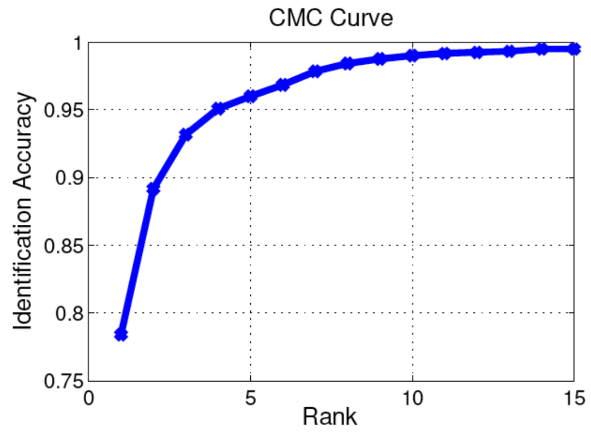

## ReID

ReID指Re-identification，常翻译为重识别。ReID任务本身分类很多，本文只讨论基于图片的ReID任务中`single-gallery-shot`这一最简单的情况。

重识别任务可以描述如下：

给定一个Gallery集合$G$，包含有$N$张图片，分属$M$个ID(identity)。给定一张未知ID的图片做query(或者叫probe), 计算出下式的结果：$max(Similarity(query, g_i)), i\in1,2,3,...,N, g_i\in G$。得到i之后，图片$g_i$对应的ID就是query的ID。大部分ReID相关的研究，都是在研究`Similarity()`这个函数，使得这个函数**在同ID时返回值高，不同ID时返回值低**。

下图就是一次典型的重识别任务:

为了更好地理解，我在这篇文中介绍一个新的重识别任务：*水果emoji重识别*。

我们现有一个水果emoji的数据集$G$：[🍍🍎🍎🍏🍍🍏🍎🍏🍍🍍🍍🍏🍎🍏🍍]，假定这个数据集中，即使是相同的emoji，图片也有细小的差别。
数据集一共包含$N=15$张图片，共有$M=3$种ID。任意给定一组query: [🍎,🍏]，从数据集$G$中找到和每个query最相近的5张图片(为了保证准确率，我们都是返回一组最相近的图片，而不是如前文所述的单独一张图片)。

我们现在有两个评价emoji之间相似程度的函数`Similarity1()`和`Similarity2()`。
对于query🍎，`Similarity1()`得到[🍍🍎🍎🍎🍏]，`Similarity2()`得到[🍎🍍🍎🍎🍏]。
对于query🍏，`Similarity1()`得到[🍏🍎🍍🍏🍏]，`Similarity2()`得到[🍎🍏🍏🍏🍍]。
得到的结果都按与query的相似度从左至右排列。那么`Similarity1()`和`Similarity2()`哪个得到的结果更好呢？

或者说：我们应该怎么度量`Similarity()`函数的性能？答案就是**CMC**和**mAP**。

## CMC

CMC是`Cumulative Matching Characteristics`的缩写，我个人把它翻译为`累计匹配特性`。ReID模型的好坏可以通过CMC曲线来评价。
为了计算CMC曲线，首先要把每次查询的结果按相似程度排序。接着，引入一个概念: $topK$准确度: $AccK$，其计算公式如下：
$$AccK=
\begin{cases}
1& \text{前K个结果中有同ID的结果}\\
0& \text{前K个结果中没有同ID的结果}
\end{cases}
$$
这里的K是一个从1开始增加的变量。显然，$AccK$形同单位阶跃函数。假设在查询得到的结果中，与query同ID的结果第一次出现时的排名为$F$，那么显然，$AccK$在$K=F$时，值由0变为1。
CMC曲线的计算方法就是，把每个query的$AccK$曲线相加，再除以query的总数，即平均$AccK$曲线。

回到我们的*水果emoji重识别*任务。
分别计算两个query的AccK曲线如下：

```text
Similarity    1          2
query🍎: 0 1 1 1 1 | 1 1 1 1 1
query🍏: 1 1 1 1 1 | 0 1 1 1 1
```

再平均各个query的AccK曲线，由此我们得到这两种相似度函数的CMC曲线都是[0.5 1 1 1 1]
由于query只有两个，所以得到的CMC的值有些简单。当query数足够大时，CMC曲线就会变成下图这样：

由于AccK曲线是一个单位阶跃函数，CMC曲线必定是一个单调递增的曲线。曲线上某个点如(R5, 0.96)就表示正确结果在前返回所有结果中排名前5的准确率能达到5%。
实际论文中，常取CMC曲线上的某几个点之间对比，比如常出现的Rank1，Rank5，就分别是CMC曲线上，K=1，5时的值。

## mAP

mAP是mean Average Precision的缩写。mAP涉及到的前置概念比较多：mAP是每个query的AP(Average Precision)的平均值，而AP又指Precision(准确率，又称查准率)的平均值。我们从头开始讲起。

对于ReID任务，我们经常关心两个问题：

1. 查询得到的结果中，有多少比例是同一ID的?
2. 同一ID的图片中，有多少比例被检索出来了?

这两个问题分别对应`查准率(precision)`和`查全率(recall)`，亦称作`准确率`和`召回率`。因为`准确率`这个称呼在别的领域有其它意义，为了防止误解，我还是喜欢用`查准率`和`查全率`的说法。

### 查准率和查全率

**查准率**就是和query同一ID的图片在查询结果中的占比。计算公式如下:
$$
precision = \frac{\mid\{同ID图片\}\cap\{查询结果\}\mid}{\mid\{查询结果\}\mid}
$$
查准率可以同时考虑所有的获取到的结果，也可以单独给定一个特定的值K，只考虑返回结果中排名前K的查询结果，在这种情况下，查准率又可以称为前K查准率，记作P@K。

**查全率**就是和query同一ID的图片出现在查询结果中的数量占总数的比例。计算公式如下：
$$
recall = \frac{\mid\{同ID图片\}\cap\{查询结果\}\mid}{\mid\{同ID图片\}\mid}
$$

查准率和查全率看上去都很有意义，但我们能直接用它俩来评判ReID模型的性能了吗？当然不行，由于查准率和查全率都是通过比例来计算，完全忽略了返回的结果是有排序的！当查询🍏时返回结果🍏🍏🍏🍎🍍和🍎🍍🍏🍏🍏当然是不一样的，但其查准率和查全率确是一样的。返回结果的顺序被忽略了。

值得注意的是，查准率和查全率是一个相互矛盾的度量，比如为了增加查全率，我们可以通过增加查询结果的数量来实现，当查询结果数量等于数据集大小时，查全率一定等于1，因为这时所有图片都被查询得到了。但此时查准率就成了最小值。所以比较模型的性能不是那么简单的事情。

### P-R曲线图

那怎么比呢？肉眼比对时，我们常从结果的第一个开始，一个一个比对。借鉴这种思路，我们可以逐渐增加查询结果的数量，从第一个开始，一直到系统给出的查询结果的最后一个，把中间每个点对应的查准率和查全率绘制到图上，得到类似下面的结果：


P-R图直观地显示出了ReID模型的查全率和查准率，显而易见，如果一个模型的P-R曲线包住了另一个模型的P-R曲线，这个模型的性能就好于另一个模型。

### Average Precision

显然，PR曲线与坐标轴围起来图形的面积一定程度上反应了ReID模型的性能，我们把这个面积叫做Average Precision。这个面积怎么求？由积分知识可得:
$$AveP = \int_{0}^1p(r)dr$$
可惜，我们得到的是曲线上一个个点，得不到$p(r)$的准确公式，没法用上面的公式计算。
但是，这个积分可以视作多个长方形条的面积之和，离散化后得到如下公式：
$$AveP = \sum_{k=1}^{n}P(k)\Delta r(k)$$
公式中的$P(k)$特指我们上文提到过的前K查准率，$\Delta r(k) = r(k)-r(k-1)$。需要注意的是，前k-1个查询结果和前k个查询结果中的同ID结果数量可能一样，所以$\Delta r(k)$可能为0。用公式写出来就是：假设数据集中有$N$个同ID查询结果，则有
$$r(k)=
\begin{cases}
\frac{1}{N}& ID(RESULT_k) = ID(query)\\
0& ID(query) \ne ID(RESULT_k)
\end{cases}
$$
所以如果令集合$\Omega$为和query同ID的第k个查询结果的集合，那么上式可以接着改写为
$$AveP = \sum_{i=1}^{n}P(i)\Delta r(i), i\in\Omega$$
即只考虑查询结果中同ID结果的查准率和查全率。网上搜mAP相关教程时经常出现的图片(来自[yongyuan.name](http://yongyuan.name/blog/evaluation-of-information-retrieval))用的就是这个公式。

为了计算AP更精确，我们可以用梯形面积公式替换矩形面积：
$$AveP = \sum_{i=1}^{n}\frac{P(i)+P(i-1)}{2}\Delta r(i), i\in\Omega, P(0)=P(1)$$
> **注意**：$\text{i-1}\in\Omega$不一定成立，所以这里的$P(i-1)$不是$\Omega$集合中的上一个点的查准率，而是第i-1个查询结果对应的点的查准率。
>
> 详细分析附在了文章最后。

这两个公式都可以计算AP，后一个公式精确度更高一些。

最后，平均一下每个query的AP值就得到了mAP。
$$mAP = \frac{\sum_{i=1}^{N_q}AveP_i}{N_q}$$

再回到我提出的水果emoji重识别任务，我们来计算下两种方法的mAP：

我们现在有两个评价emoji之间相似程度的函数`Similarity1()`和`Similarity2()`。
对于query🍎，`Similarity1()`得到[🍍🍎🍎🍎🍏]，`Similarity2()`得到[🍎🍍🍎🍎🍏]。
对于query🍏，`Similarity1()`得到[🍏🍎🍍🍏🍏]，`Similarity2()`得到[🍎🍏🍏🍏🍍]。

拿计算`Similarity1()`在query为🍎举例：

```text
match1 i=1 (P(0), P(1)) = (1/2, 1/2)
match2 i=2 (P(1), P(2)) = (1/2, 2/3)
match3 i=3 (P(2), P(3)) = (2/3, 3/4)
```

所以$AP=\frac{0.5+0.5}{2}*\frac{1}{3}+\frac{0.5+0.66}{2}*\frac{1}{3}+\frac{0.66+0.75}{2}*\frac{1}{3}=0.597222$
query为🍏时，$AP=0.766666$所以$mAP=0.682$

同理可以计算`Similarity2()`的mAP为0.722，所以我们最终得到，`Similarity2()`优于`Similarity1()`

## 更正：

写完这篇文章以后我就准备写代码实现这两个代码，参考一直用着的一份baseline代码[Person_reID_baseline_pytorch](https://github.com/layumi/Person_reID_baseline_pytorch)时以为其计算方法和我上面的公式不一样，我一下子没理解，还给这个repo发了一个[issue](https://github.com/layumi/Person_reID_baseline_pytorch/issues/110)。

[@layumi](https://github.com/layumi/)的解释我最后才看懂，发现是我理解错误了。
上面的公式 $AveP = \sum_{k=1}^{n}P(k)\Delta r(k) = \sum_{i=1}^{n}P(i)\Delta r(i), i\in\Omega$是成立的。但是，当为了精确使用梯形面积代替长方形面积时，我用了下面的公式：
$$AveP = \sum_{i=1}^{n}\frac{P(i)+P(i-1)}{2}\Delta r(i), i\in\Omega, P(0)=P(1)$$
这种公式中的i是什么容易引起误会，我就一下子搞错了，错误地指责@layumi写错了代码。这里的i不是遍历用的下标1,2,3,4...而是$\Omega$集合中的点2,5,6,7（随便举得例子）。所以，$i-1\notin\Omega$可能成立，我自己错误地把$P(i-1)$当作了$\Omega$中前一个点对应的查准率。

**所以，我自己搞错了自己写的公式，抑郁之情难以言表。**