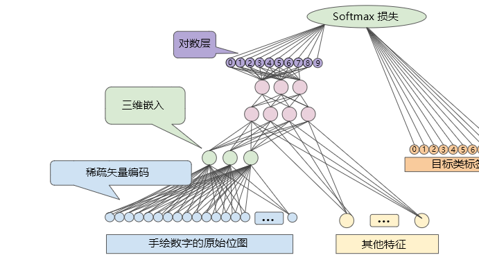

你也许会感到惊奇，我开始读论文时，花了很长时间才搞明白`embedding features`这个概念。尽管到最后我也没搞懂如何**信达雅**地翻译“embedding”这个词，但还是分享下现在[^now]我对`embedding`的理解吧。

`embedding`可能首先出现在NLP领域。网上搜索embedding，结果中有很多`word embeddings`相关的内容。接着embedding逐渐扩散成为机器学习中的一个经典概念。

`embedding`在数学[^wiki]上指：一个数学结构经映射包含到另一个结构中。直接引用wikipedia的原文：

> When some object X is said to be embedded in another object Y, the embedding is given by some injective and structure-preserving map f : X → Y.

embedding就是映射的过程：X映射到Y，这个映射由两个特点：**injective**和**structure-preserving**。**injective**就是单射(回想一下函数的概念)，指所有x,y∈A,且x≠y，都有f(x)≠f(y)；而**structure-preserving**可以翻译为保持结构，这里“保持结构”的具体含义，需要根据所讨论的结构或具体数学问题而定，比如在X所在的空间，有X1<X2, 那么映射得到的Y1，Y2在Y空间也有约束：Y1<Y2。

所以在机器学习领域，embedding指将数据转换为**合适**的特征表示，**合适**是指样本特定的属性可以用距离的概念表示出来。通过embeding可以将原始样本数据转换为适合机器学习的特征数据。比如，针对同一个语音样本集，一个区分说话人的模型可以把语音样本转换为一个数值向量，来自同一人的语音样本对应的`embedding features`有着更小的欧式距离；然而对于另一个识别语音内容的模型，说了相同话的语音(而不是同一个人的语音)对应的`embedding features`会有更小的欧式距离。甚至你还可以再设计一种映射来表达“愤怒”，“高兴”等情绪。**embedding features就是方便用距离表示属性相似程度的特征**，属性相似的样本对应的特征之间距离更小，这正是前一段提到的`structure-preserving`。

之前提到过，embedding在NLP领域出现更多些。我们就拿NLP领域的一个神器`word2vec`举个例子，word2vec可以把单词转换成一个很神奇的特征空间中的点(向量): 假设Φ(X)是X对应的`embedding features`, 那么Φ(Germany) - Φ(Berlin) ≈ Φ(France) - Φ(Paris)! 首都这个概念也能用embedding features表示！

相应的，CV领域的`embedding`也表示类似的概念，直接用Google教程[^google-mooc]视频中的一页关于手绘数字识别的ppt作为例子：

手绘数字图像对应的稀疏矢量特征首先用一个预先设计的映射转换为embedding features后再作为神经网络的输入。embedding features是更好的特征表达。

可以看出，`embedding features`只是一个很简单的东西，含义不难理解，看论文时我却纠结了很久。道阻且长,行则将至。

[^now]: 我还在学习中，以后的理解会更深刻些吧。
[^wiki]:[embedding(嵌入)的维基百科词条](https://en.wikipedia.org/wiki/Embedding)
[^google-mooc]: [Google's Machine Learning Course](https://developers.google.com/machine-learning/crash-course/embeddings/video-lecture) 这门课程的PPT是机器翻译，效果不是很好，很多术语都翻译错了。