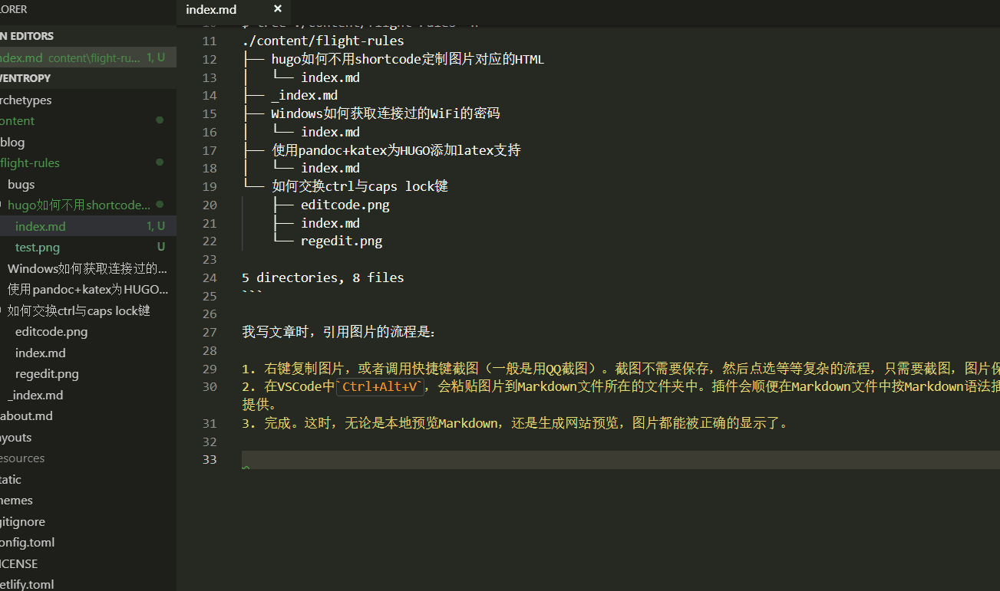

## 文件组织

我的网站使用的生成器是hugo。为了方便地引用，保存图片，我现在采用如下的文件组织形式：

```bash
$ tree ./content/flight-rules -n
./content/flight-rules
├── hugo如何不用shortcode定制图片对应的HTML
│   └── index.md
├── _index.md
├── Windows如何获取连接过的WiFi的密码
│   └── index.md
├── 使用pandoc+katex为HUGO添加latex支持
│   └── index.md
└── 如何交换ctrl与caps lock键
    ├── editcode.png
    ├── index.md
    └── regedit.png

5 directories, 8 files
```

图片被存储在markdown文件所在的文件夹中。方便管理。同时，在git仓库中存一份图片可以当作图片的备份，以防特殊情况下图床上的图片丢失。

## 引用图片

我写文章时，引用图片的流程是：

1. 右键复制图片，或者调用快捷键截图（一般是用QQ截图）。截图不需要保存，然后点选等等复杂的流程，只需要截图，图片保存到剪贴板就可以了。
2. 在`VSCode`中`Ctrl+Alt+V`，会粘贴图片到Markdown文件所在的文件夹中。插件会顺便在Markdown文件中按Markdown语法插入图片。这项功能由`Markdown Paste`插件提供。

这时，无论是本地预览Markdown，还是生成网站预览，图片都能被正确的显示了。

我截图并引用一张图片的全流程：


看起来还是比较方便的。目前面临的最大的问题是：我老忘记`Ctrl+Alt+V`这个快捷键。

## 替换图片src

但是，这种文件组织形式下，引用的图片是放在netlify上的。在国内访问的速度不够快，所以国内大部分人还是习惯把图片放在图床上。
我现在用腾讯云COS做图床，在发布博客时，我希望最后生成的HTML文件引用的是图片在腾讯云上的链接，而不是相对于`index.md`的链接。
怎么才能实现这个功能呢？

答案是：靠正则！由于hugo处理Markdown后得到的图片输出一定是``这样的形式，我们可以用正则提取出src和alt甚至title部分(如果有的话)，然后重新组织生成的``tag。hugo中，正则替换的函数是[replaceRE](https://gohugo.io/functions/replacere/)。

几乎所有的hugo主题，导入由Markdown文件转换得到的HTML内容的代码是`layouts/_default/single.html`中`{{ .Content }}`。
把`{{ .Content }}`替换为以下代码：

```text
{{ if .Site.Params.CDN.enable }}
    {{ $reAltIn := "" }}
    {{ $reAltOut := (printf "" .Site.Params.CDN.Host .Dir )}}
    {{ $altContent := .Content | replaceRE $reAltIn $reAltOut | safeHTML }}

    {{ $reAltTitleIn := "" }}
    {{ $reAltTitleOut := (printf "" .Site.Params.CDN.Host .Dir )}}
    {{ $finalContent := $altContent | replaceRE $reAltTitleIn $reAltTitleOut | safeHTML }}

    {{ $finalContent }}
{{ else }}
    {{ .Content }}
{{ end }}
```

然后在`config.toml`中加入相应的参数内容：

```toml
[params.CDN]
#enable = false
enable = true
# Host must end with `/`
Host = "https://lowentropy.jinxiapu.cn/img/"
```

图片的src就由`test.jpg`被替换为`https://lowentropy.jinxiapu.cn/img/{{ .Dir }}/test.jpg`，这里的{{ .Dir }}是Markdown文件相对于content文件夹的地址。可以按照自己的喜好更改。拿我[上一篇博客](https://lowentropy.me/blog/20190223-reid%E4%BB%BB%E5%8A%A1%E4%B8%AD%E7%9A%84cmc%E5%92%8Cmap/)做个参考：

Markdown中引用图片代码为``，如果直接用`{{.Content}}`，会得到

```html

```

这时，引用的图片存放于netlify上。更改`{{ .Content }}`后得到：

```html

```

只要你已经相应地把图片上传到腾讯云COS`img/blog/ReID任务中的CMC和mAP/ranked_results.jpg`这个位置。网站上就能成功地显示经过CDN缓存后的图片了。

注意，上面的代码只是一个参考，如果你直接拿过去用，记得采用和我相同的图片存储方式。

## 上传本地图片到腾讯云COS

当然不用手动上传图片，用腾讯云COS官方提供的上传工具`coscmd`写个脚本就可以啦！

脚本中最关键的上传函数如下：

```bash
upload()
{
    localpath=$1
    # "./content/blog/test/test.jpg" -> "img/blog/test/test.jpg"
    uploadpath="img/"${localpath/.\/content\//}
    coscmd upload -s -H '{"Cache-Control":"max-age=2592000"}' "$localpath" "$uploadpath"
}
```

用`git ls-files -z -mo --exclude-standard`可以遍历project中untrack和modified的文件，判断一下是否是图片以后直接用`upload()`上传就好了！

完整地脚本在这里：[upload-imgs.sh](https://github.com/RayHY/LowEntropy/blob/master/upload-imgs.sh)

## 自动运行脚本

没必要手动运行上面的脚本：利用git，在`pre-commit`时调用`upload-imgs.sh`就可以了。

所以，配置好上面说的内容后，我写博客引用图片的全流程依然是上面的两步：

1. `Ctrl+C`或者`Ctrl+Alt+A`（QQ截图快捷键）复制图片。
2. `Ctrl+Alt+V`粘贴图片。

这就是两次快捷键完成Markdown中引用图片的全部过程。