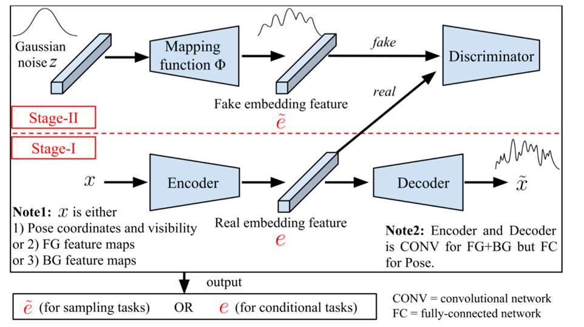

| title  | Disentangled Person Image Generation                                                  |
| ------ | :------------------------------------------------------------------------------------ |
| from   | CVPR2018 [spotlight](https://www.youtube.com/watch?v=vy2KgNdVRfo)                     |
| author | Liqian Ma, Qianru Sun, Stamatios Georgoulis, Luc Van Gool, Bernt Schiele, Mario Fritz |
| arxiv  | [1712.02621](https://arxiv.org/abs/1712.02621)                                        |

## 速览(翻译自作者的介绍[^intro])

**Motivation**:训练一个能明确表示前景，背景和姿势的图片生成模型

**Task**:以自监督学习方式，独立控制前景，背景和姿势生成，以合成人类图片

**Key idea**:先将图片分解为上述三个部分，然后再融合起来。

**Contributions**:

1. 提出了一种通过将输入划分为弱相关因素的生成人物图像新任务
2. 设计出一种两阶段的框架来学习可操作的嵌入特征(embedding features)
3. 创造了一种通过对抗学习(adversarial training)来匹配真假嵌入特征分布的技术
4. 贡献了一种生成re-ID任务图像对(image pairs)的方法

## Two-stage framework

整个框架分为两个阶段：

1. 第一阶段把输入分为前景，背景，姿势三个因素，通过重建网络生成特征。
2. 学习一个映射函数来把高斯分布映射到特征分布。

预训练的解码器和编码器指导映射函数的学习过程。
创新点1：新生成的图像是从生成的伪特征重建而来，不像传统的GAN是从高斯噪声重建图片的。
$z->e->x$，作者认为这种思路使我们不仅能够为生成器采样可控输入，而且还能够保留合成图像（即真实人物图像）的复杂性。作者在CVPR会议上讲论文时也提到原因包括人的图像很复杂，直接从高斯噪声生成很难。

注意点：输入的 x可能是姿势坐标和可见性，或者是前景，背景的特征。准确地说是每种因素都要走一遍上述的两个阶段。$x(R)$

[^intro]: [Paper Project Page](https://homes.esat.kuleuven.be/~liqianma/CVPR18_DPIG/)