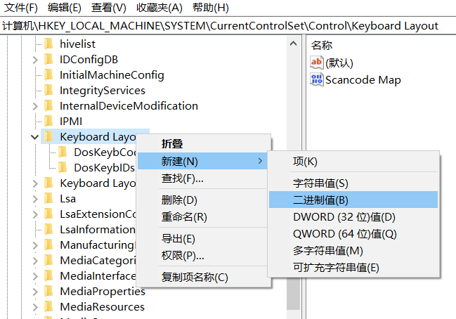
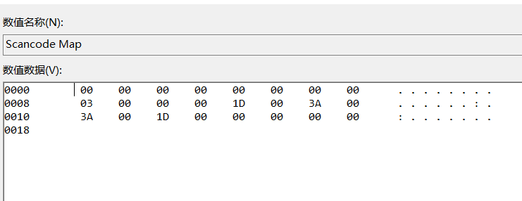

最近准备尝试下交换CTRL与Caps lock键。已经有很多交换这两个按键的方式。但大都不太满足我的要求：最好不装软件，最好很容易恢复到原来的样子。

最后发现还是用windows自带的注册表做这件事比较方便：

1. Windows+R 打开`运行`
2. 输入`regedit`，打开注册表管理器。
3. 定位到`HKEY_LOCAL_MACHINE\SYSTEM\CurrentControlSet\Control\Keyboard Layout`，注意，这里是`Keyboard Layout`而不是`Keyboard Layouts`。
4. 新建二进制值：`Scancode Map`
   
5. 右键编辑这个二进制值为

```plaintext
00 00 00 00 00 00 00 00
03 00 00 00 1d 00 3a 00
3a 00 1d 00 00 00 00 00
```

编辑时可能有点不顺手，不用害怕，反正最终效果如下：



最后重启电脑就好了！

补充下上面的数字的意思：

注意阅读数字时，每4个为一组。

* `00 00 00 00`是`header version`，永远是0。
* `00 00 00 00`是`header flag`, 永远是0。
* `03 00 00 00`是指要改变的键数以及最后肯定要加的NULL终止符，这里就是3了。
* `1d 00 3a 00`中，`0x001d`是`LEFT CTRL`的代码，`0x003a`是`CAPSLK`的代码，这串数字表示按下`0x003a`时发送`0x001d`。
* `3a 00 1d 00`则与上述相反，按下`0x001d`时发送`0x003a`。这样我们就交换了这两个按键。
* NULL终止符行，对应第3组里3代表的第3行。

如果你不想交换这两个按键了，比如我现在，就不太想交换了。就把上面新建的这个注册表项删掉重启好了。