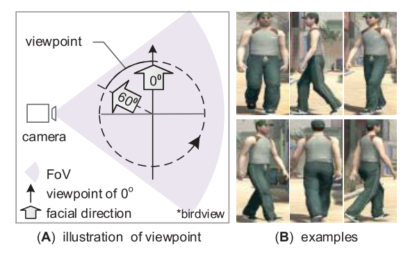
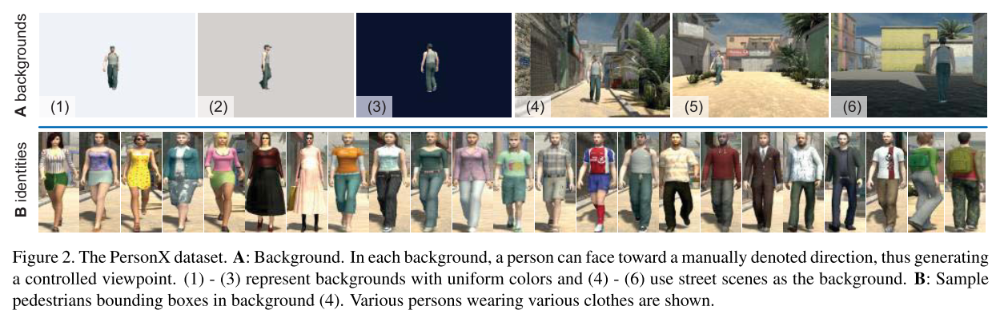
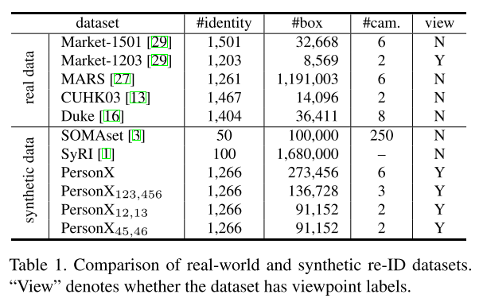
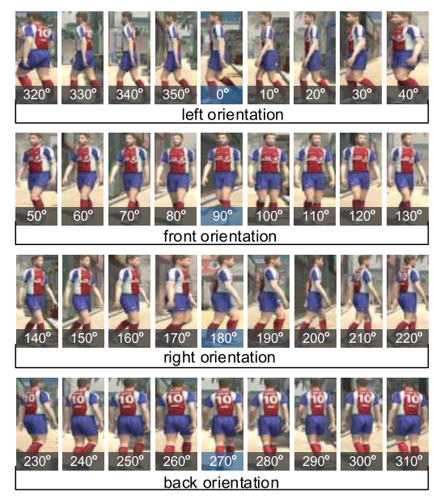
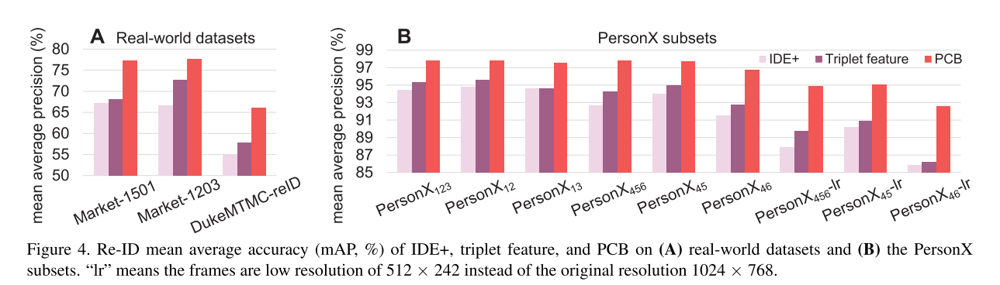

| 属性 | 值           |
| ---- | ------------- |
| 作者 | Xiaoxiao Sun, **Liang Zheng** |
| 标题 | [Dissecting Person Re-identification from the Viewpoint of Viewpoint](http://arxiv.org/abs/1812.02162) |
| 会议 | CVPR2019 |
| 任务 | Quantitative Study on how Viewpoint affect re-ID system  |

## 介绍

我们都明白视角，姿势，光照等等因素对ReID任务影响很大，几乎所有的ReID的模型都很考虑这些因素对ReID任务的影响，针对性地提出改进的措施。
但是到目前为止，没有人定量地分析过这些因素究竟对ReID任务有多大影响。郑良老师这篇论文是针对视角(Viewpoint)对ReID任务的影响定量分析的一个`early attempt`。

大家肯定都想定量研究，但为啥到现在还没人做呢？主要是因为没数据啊！现有的数据集光照在变，背景在变，姿势在变，你怎么单独地研究视角这一个因素对ReID的影响？郑良老师干脆提出了一个叫`PersonX`的数据合成引擎，`PersonX`包含1266个手工设计的`identity`，可以方便地控制视觉变量，合成不同条件下的行人图片。

如图一，视角就是行人的旋转角度，`PersonX`可以非常方便地合成除角度不同以外都一致的行人图片。控制变量做的相当好了。

### PersonX

PersonX是基于`Unity`引擎的，最关键的特点是`Controllable`。可控才能用来设计实验数据集，方便控制变量。

这个数据集包含1266个行人，建模得到的行人包含不同肤色，年龄，身材，发型，衣服也不一致，部分角色也背着包带着眼镜或者帽子，行人的动作可能是走，跑，站...总之，尽力模仿真实情况。

由于是3D引擎合成的图片，光照，成像，背景，视角这些全部可控。`PersonX`不仅仅只能用在这篇文章探究的视角影响上，还能用于以后的各种研究。

## 实验

### PersonX上的结果有参考价值吗？

在合成数据集上做的实验，一个异常关键的问题是，能反应真实情况吗？结果有参考价值吗？数据集分布变化那么大，还有用吗？

作者首先把`PersonX`数据集分为6个子集，划分依据是人物背景，分别模拟纯色背景，复杂背景，纯色但相反背景，复杂但场景相似背景等情况。
每个子集的训练集都是410个行人，测试集856个，一个行人每种背景都有36张图片，即36个不同视角。然后，用3种ReID模型: IDE+, Triplet feature, PCB来测试，得到的在不同数据集上的测试结果如下：

作者分别从`eligibility`, `purity`, `sensitivity`三个方面对比分析了上图的结果，指出3种方法的性能对比维持不变，由于合成数据比较"纯粹"，所以mAP高，PersonX子集背景的变化也反应在mAP上，性能对比和预计的一样。由此，作者认为这个数据集可以作为对比视角左右的基础，能够模拟真实情况。在PersonX上得到的结果有参考价值。

### 视角因子影响分析

作者分训练集，测试集，查询集，分别探索集合中视角分布对re-ID准确率的影响。由于数据集图片可以自己生成，做实验异常方便。
作者用PCB作为实验方法，通过不同实验设置，得到以下结论。

#### 训练

1. 缺失部分视角图片会影响训练
2. 缺失连续视角的图片比缺失随机视角的图片危害更大
3. 当只有一部分视角的图片可用时，左/右视角的图片比前/后视角的图片更好。这可能是因为模型可能会更关注前/后视角的图片中人衣服的图案，纹理，而这些东西换一个视角就没了。

#### 查询

1. 以左/右视角图片做查询比用前/后视角做查询效果更好
  
#### 测试

1. 和查询图片视角相异的`True Match`可能比和查询图片视角相同的`False Match`更难找到。
2. 当数据集加入更多影响因素，如复杂的背景，光照，低分辨率等等。上面提到的问题会更加严重。

## 总结

看完整篇文章，感觉确实可能更偏`early attempt`一些，怎么说，用3D引擎生成的图片来实验，特别有助于控制变量。但同时也导致，得到的具体数字毫无参考价值，只能通过详实的对比实验来定性的分析结果。最终得到的结果也没有太新颖，和人直观的理解比较接近。说是要定量分析，到最后却只能得到定性的结果。

不过，`PersonX`的提出可能不仅仅只能用在这篇论文后面的几个实验中，也可用来做更复杂的想法的一个印证。