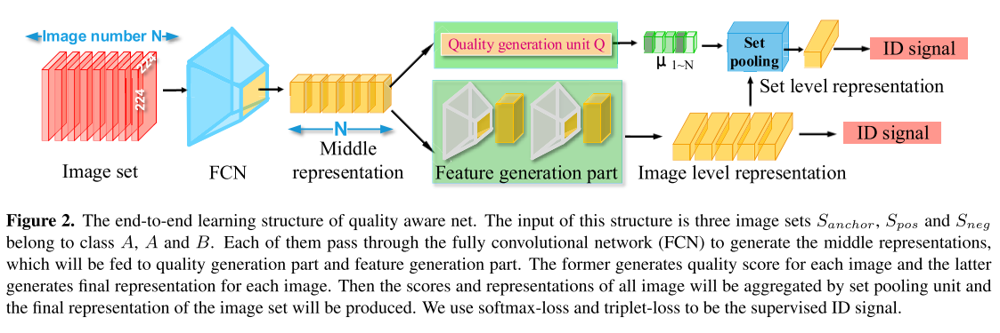
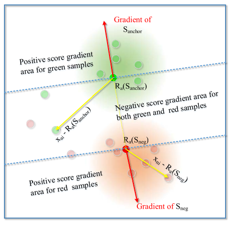
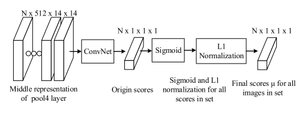

| 属性 | 值           |
| ---- | ------------- |
| 作者 | Liu, Yu, Junjie Yan, and Wanli Ouyang |
| 标题 | [Quality Aware Network for Set to Set Recognition](http://openaccess.thecvf.com/content_cvpr_2017/papers/Liu_Quality_Aware_Network_CVPR_2017_paper.pdf) |
| 会议 | CVPR2017 |
| 任务 | Set to Set Recognition  |

## 介绍

现在各种重识别很火，比如人脸识别或者行人重识别。在研究中，我们常使用这样的设置：一个identity一张图片，在gallery中查询与query同identity的图片。但是在实际应用中，某个identity的图片不止一张。我们能用来查询的，经常是视频录像中的一段镜头，又或者是同一个对象不同角度的图片。如果这时候还使用一张图片来查询相似的图片，不免就太亏了。由此，**Set to Set Recognition** 就很有必要了。

为了用图片集做识别，我们常需要将多个图片的特征融合得到最终的集合特征。实现这个融合最简单的思路就是最大/平均池化多个特征。但是，这种思路有一个问题：图片集中的部分图片根本不适合识别，比如抖动的图片或者遮挡严重的图片。简单地池化容易让这些没用的图片“污染”了最后的结果。

这篇文章主要就是为了解决上述问题，基本思路是：**在聚合图片时，为图片集中的每张图片都指定一个质量打分**。文章中的网络包含一个质量打分分支和特征提取分支。最重要的是，这两个分支可以联合训练，**不需要人类预先对图片质量打分**。不需要人来打分这点我很喜欢，这肯定可以减少“人工智能”中的“人工”部分，与此同时，也暗地里反映了一个问题：人觉得好的图片不一定对重识别任务也好。人对图片打分时的关注重点和网络区分不同身份时的关注点不一定是完全一致的。用直接优化最后得到的嵌入特征的loss的方法来给图片打分，屏蔽了人的打分和重识别任务所需打分之间的gap。

## QAN

### 形式化描述

现有一个图片集$S=\{I_1, I_2, I_3, \dots, I_N\}$，图片集及其中图片的特征分别表示为$R_a(S)$和$R_{I_i}=R(I_i)$。我们的目标是，不论$N$值大小，设计一个特殊的聚合函数$F$, 使得:
$$R_a(S) = F(R_{I_1}, R_{I_2}, \dots, R_{I_N})$$

作者认为图片质量越差，对识别任务的重要性越低。由此，假设图i的质量打分为$\mu_i$，得到：

$$F(R_{I_1}, R_{I_2}, \dots, R_{I_N})=\frac{\sum_{i=1}^N\mu_iR_{I_i}}{\sum_{i=1}^N\mu_i}$$

其中$\mu_i=Q(I_i)$。由此，最关键的问题就是，如何端到端地训练函数$Q$和$R$。

这个机制其实很容易看懂，图片集被输入网络得到中间表达，然后中间表达分别送入质量打分单元和特征生成模块。特征生成模块得到的图片特征用质量打分做权值加权得到图片集特征。

### 中间特征定在哪？

从上面的网络结构我们可以知道，`Quality generation unit Q`其实就是插到网络中间的一个部件，这个部件可以插入到4个pool层，或者fc层后面，最后定在哪里是作者做实验比对出来的：

实验结果说明放在Pool3后效果最好。这个结论其实换个网络可能就变了，自己用的时候多做几组实验对比一下吧。

### 训练过程

这篇论文的训练分为两个Level：image level 和 set level，分别被Softmax Loss($L_{class}$)和Triplet Loss($L_{veri}$)约束。

其中，对于set level训练，使用Triplet Loss，所以相应地也使用了(anchor set, positive set, negative set)这样的采样设置。

最终，图片的特征提取部分，同时受到image level和set level的loss约束，即两个level做后向传播时特征提取部分的参数都会改变。但对于打分部分，只受set level的loss即($L_{veri}$)约束。

如上图，红箭头是图片集的梯度方向，黄箭头是图片集中某张图片的特征和图片集加权中心的差。可以推导出:
$$\frac{L_{veri}}{\mu_i}=(R_{I_i}-R_a(S))\cdot(\frac{\partial L_{veri}}{\partial R_a(S)})^T$$
所以黄红箭头的乘积就是打分的梯度。由此我们可以得出结论，只要$R_{I_i}-R_a(S)$与图片集特征梯度方向夹角在$(-90^\circ,90^\circ)$中，那么样本的质量打分就会增加，反之则减少。即，和图片集特征梯度方向一致的就是好样本，不一致就是坏样本。*（和下一步政策一致的就是好同志，不一致的就是坏同志）*。

打分部分的网络结构也不复杂：

## 思考

因为我也不是做视频re-id的，不太在意QAN具体的结果。论文后面的实验部分我没有放上来，总结一下就是提点很多。

我很喜欢QAN端到端自动打分的设计，看看能不能借鉴一下。